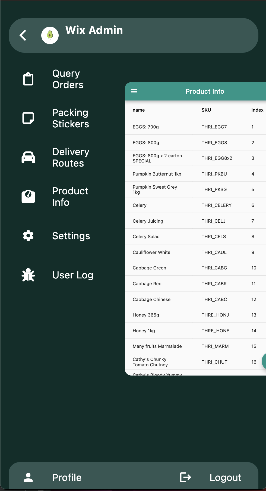

# wt_app_scaffold

An extension to the idea of scaffolds, making it easier to start a new project and just
focus on the functionality.

## Defining and application

```dart
abstract class AppOne {
  static final details = Provider<AppDetails>(
    name: 'AppOne Details',
    (ref) => AppDetails(
      title: 'Application One',
      subTitle: 'First application',
      iconPath: 'assets/avocado.png',
    ),
  );

  static final definition = Provider<AppDefinition>(
    name: 'AppOne Definition',
    (ref) => AppDefinition.from(
      appTitle: 'Application One',
      appName: 'appOne',
      swipeEnabled: true,
      debugMode: true,
      includeAppBar: true,
      appDetailsProvider: details,
      profilePage: PageDefinition(
        icon: Icons.person,
        title: 'Profile',
        builder: (context) => ProfileScreen(
          auth: ref.read(FirebaseProviders.auth),
          actions: [
            SignedOutAction((context) {
              Navigator.pushReplacementNamed(context, '/');
            }),
          ],
          actionCodeSettings: FirebaseAuthKeys.actionCodeSettings,
          showMFATile: false,
        ),
      ),
      pages: [
        PageDefinition(
          title: 'Page One',
          icon: FontAwesomeIcons.clipboard,
          debug: false,
          builder: (context) => BottomDrawerPage(
            title: 'Page One',
            mainWidget: const Center(
              child: Text('Page One'),
            ),
            drawWidget: const Center(
              child: Text('Page One Controls'),
            ),
            includeAppBar: false,
            action: ref.read(ActionOne.provider),
            actions: [
              ref.read(ActionOne.provider),
              ref.read(ActionTwo.provider),
            ],
          ),
        ),
        PageDefinition(
          title: 'Page Two',
          icon: FontAwesomeIcons.bagShopping,
          debug: false,
          builder: (_) => const PlaceholderPage(title: 'Page Two'),
        ),
        PageDefinition(
          title: 'Page Three',
          icon: FontAwesomeIcons.boxesPacking,
          debug: true,
          builder: (_) => const PlaceholderPage(title: 'Page Three'),
        ),
        PageDefinition(
          title: 'Page Four',
          icon: FontAwesomeIcons.tractor,
          debug: true,
          builder: (_) => const PlaceholderPage(title: 'Page Four'),
        ),
        PageDefinition(
          title: 'Page Five',
          icon: FontAwesomeIcons.car,
          debug: true,
          builder: (_) => const PlaceholderPage(title: 'Page Five'),
        ),
        PageDefinition(
          title: 'Counter',
          icon: Icons.settings,
          primary: true,
          builder: (_) => const CounterAppPage(title: 'Counter App'),
        ),
        PageDefinition(
          title: 'Database',
          icon: FontAwesomeIcons.database,
          primary: true,
          builder: (_) => const DatabaseExamplePage(),
        ),
        PageDefinition(
          title: 'Async',
          icon: FontAwesomeIcons.arrowsRotate,
          primary: true,
          builder: (_) => const AsyncExamplePage(),
        ),
        PageDefinition(
          title: 'Settings',
          icon: Icons.settings,
          primary: true,
          builder: (context) => SettingsPage(
            children: [
              ElevatedButton(
                  onPressed: () {
                    Navigator.of(context).pushNamed("/");
                  },
                  child: const Text('Login')),
            ],
          ),
        ),
      ],
    ),
  );
}
```

## Example of running the application.

```dart
import 'package:wix_admin/firebase_options.dart';
import 'package:wt_app_scaffold/app_scaffolds.dart';
import 'package:wt_firepod/wt_firepod.dart';

import 'app/wix_admin.dart';

void main() async {
  runMyApp(
    withFirebase(
      andAppScaffold(
          appDetails: AppOne.details,
          appDefinition: AppOne.definition,
          loginSupport: const LoginSupport(
            googleEnabled: true,
            emailEnabled: true,
          )),
      appName: 'wix-admin',
      firebaseOptions: DefaultFirebaseOptions.currentPlatform,
    ),
  );
}
```

## Screenshot of an example app

This is a screenshot of the menu screen, where the current page slides to the side
and becomes smaller, to reveal the menu that is below it.

<p align="center">
    
</p>